# tidepool.nvim

A deep teal-navy Neovim theme built for eye comfort and hierarchy through
restraint. Scaffolding (keywords, operators, punctuation) recedes into quiet
slate. Verbs and data lead: lavender functions, gold types, sage strings,
pine constants. Bold is reserved for definitions.

## Screenshots

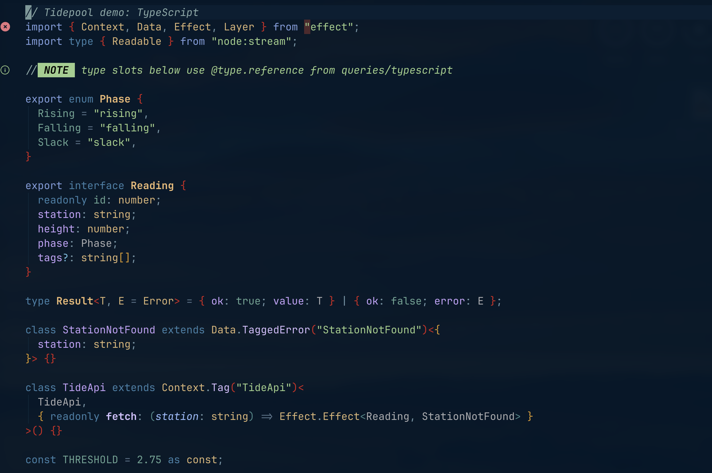

<table>
  <tr>
    <th>TSX / React</th>
    <th>Rust</th>
  </tr>
  <tr>
    <td>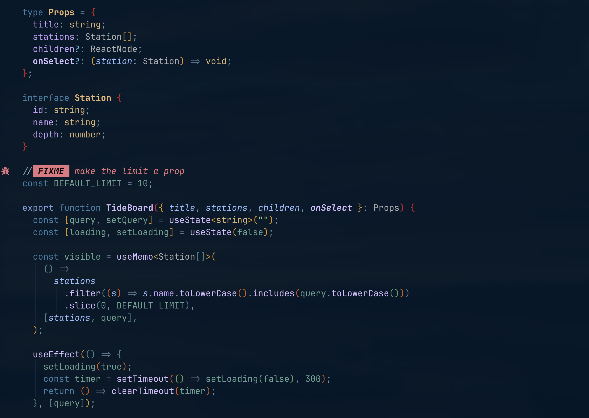</td>
    <td>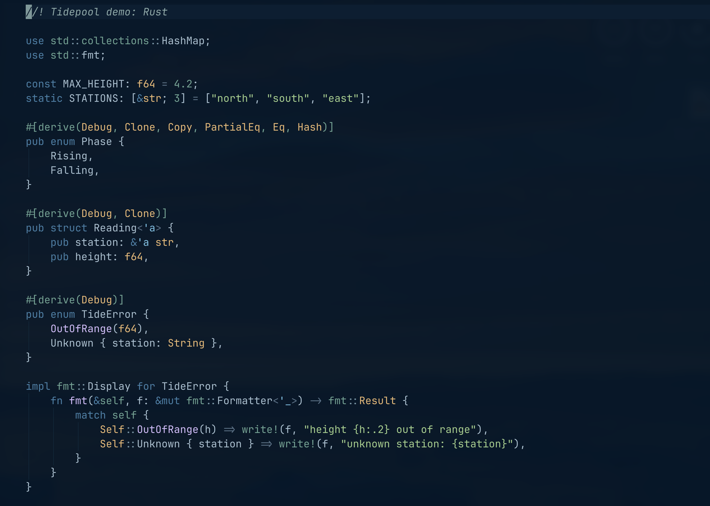</td>
  </tr>
</table>

## Design principles

- Dark but never pure black base (`#011627`): softer on halation and astigmatism.
- Body text sits near 8:1 contrast (above WCAG AAA's 7:1 for dark surfaces).
- Desaturated accents: saturated hues fail contrast on dark backgrounds.
- Few hues, used consistently, so color carries meaning instead of decoration.
- One warm accent (`EffectGen`) advances against the cool base for markers
  that must leap off the page.

## Palette

<!-- palette:start -->
Swatches show the default `hybrid` palette. Values for `muted` and `lifted`
are in [PALETTE-LIFT.md](PALETTE-LIFT.md).

### Backgrounds and UI

| | Name | Hex | Used for |
| --- | --- | --- | --- |
| 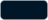 | `base` | `#011627` | Editor background |
| 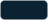 | `surface` | `#0b2233` | Floating windows, popup menu, statusline, tabline |
| 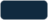 | `overlay` | `#102a3f` | Selected menu item, matching paren, quickfix line |
| 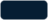 | `cursorline` | `#061e33` | Cursor line, color column, folds |
|  | `visual` | `#2d5a7e` | Visual selection |
| 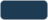 | `border` | `#1d3b52` | Float borders, window separators, indent guides |
| 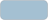 | `text` | `#a4c0d2` | Body text |
| 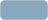 | `subtle` | `#88a8be` | Secondary UI text, statusline |
| 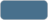 | `muted` | `#48708c` | Line numbers, whitespace, fold column |
| 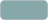 | `comment` | `#86a8a8` | Comments |

### Syntax

| | Name | Hex | Used for |
| --- | --- | --- | --- |
|  | `keyword` | `#3e80a8` | Keywords, kept quiet |
| 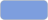 | `keyword_module` | `#7d9ede` | import and export |
| 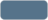 | `operator` | `#56738a` | Operators |
| 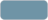 | `punctuation` | `#6f94a6` | Brackets and delimiters |
| 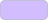 | `iris` | `#d2bdff` | Functions and method calls |
| 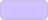 | `iris_bright` | `#d0c0ff` | Function definitions |
| 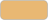 | `gold` | `#e9b873` | Type declarations, warnings, git changes |
| 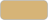 | `gold_soft` | `#d6b477` | Type references, builtin types, constructors |
| 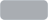 | `type_slot` | `#a9adb2` | Names in TypeScript type slots |
|  | `olive` | `#9cce8b` | Strings, hints, git additions |
| 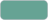 | `pine` | `#66a394` | Constants, numbers, booleans, readonly values |
|  | `foam` | `#6cc0e5` | Builtins, titles, info, active line number |
| 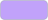 | `member` | `#c1a2fa` | Properties and fields |
| 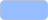 | `parameter` | `#96bdff` | Parameters |
| 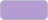 | `module` | `#b49cd1` | Modules and namespaces |
| 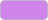 | `rose` | `#d083e8` | Markup tags |
|  | `sql` | `#c0e396` | SQL keywords |
| 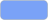 | `mint` | `#7aa2f7` | Links and directories |

### Signals and diff

| | Name | Hex | Used for |
| --- | --- | --- | --- |
| 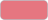 | `love` | `#e67680` | Errors, git deletions |
| 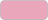 | `effect_gen` | `#eaa6ba` | Effect.gen marker |
| 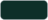 | `diff_add_bg` | `#0e2f29` | Diff added line |
| 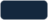 | `diff_change_bg` | `#14283e` | Diff changed line |
|  | `diff_text_bg` | `#274a6b` | Diff changed text |
| 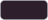 | `diff_delete_bg` | `#2e1f2d` | Diff deleted line |
<!-- palette:end -->

## Install (lazy.nvim)

```lua
{
  "rashedInt32/tidepool.nvim",
  lazy = false,
  priority = 1000,
  opts = { transparent = true },
  config = function(_, opts)
    require("tidepool").setup(opts)
    vim.cmd.colorscheme("tidepool")
  end,
}
```

## Options

```lua
require("tidepool").setup({
  -- "muted" original | "lifted" everything brighter | "hybrid" (default) lifted content
  -- over muted scaffolding. See PALETTE-LIFT.md.
  palette = "hybrid",
  transparent = false,
  styles = { bold = true, italic = true, italic_identifiers = false },
  on_highlights = function(groups, palette)
    groups.Comment = { fg = palette.subtle, italic = true }
  end,
})
```

## Coverage

Editor UI, legacy syntax, full treesitter captures, LSP semantic tokens
(static links, no autocmd), diagnostics, diff/git, terminal palette, and:
blink.cmp, telescope, snacks, gitsigns, flash, which-key, noice, lazy,
mason, indent-blankline, trouble, oil, render-markdown, todo-comments.

TypeScript and TSX ship an extra query that paints `Effect.gen(...)` calls
with the warm `EffectGen` accent. TODO/FIXME badges in comments need the
`comment` treesitter parser (`:TSInstall comment`).

## Examples

The [`examples/`](examples/) folder has demo files in 18 languages for
previewing the theme. Open any of them after loading the colorscheme:

```sh
nvim -c 'colorscheme tidepool' examples/typescript.ts
```

## License

MIT. See [LICENSE](LICENSE).
